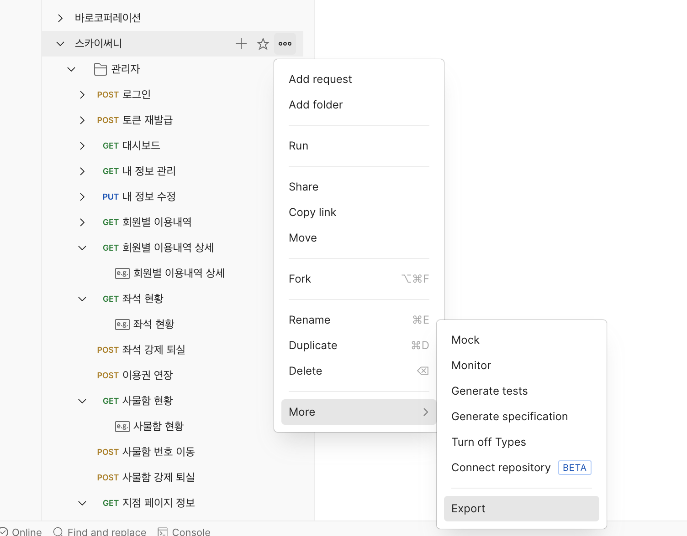
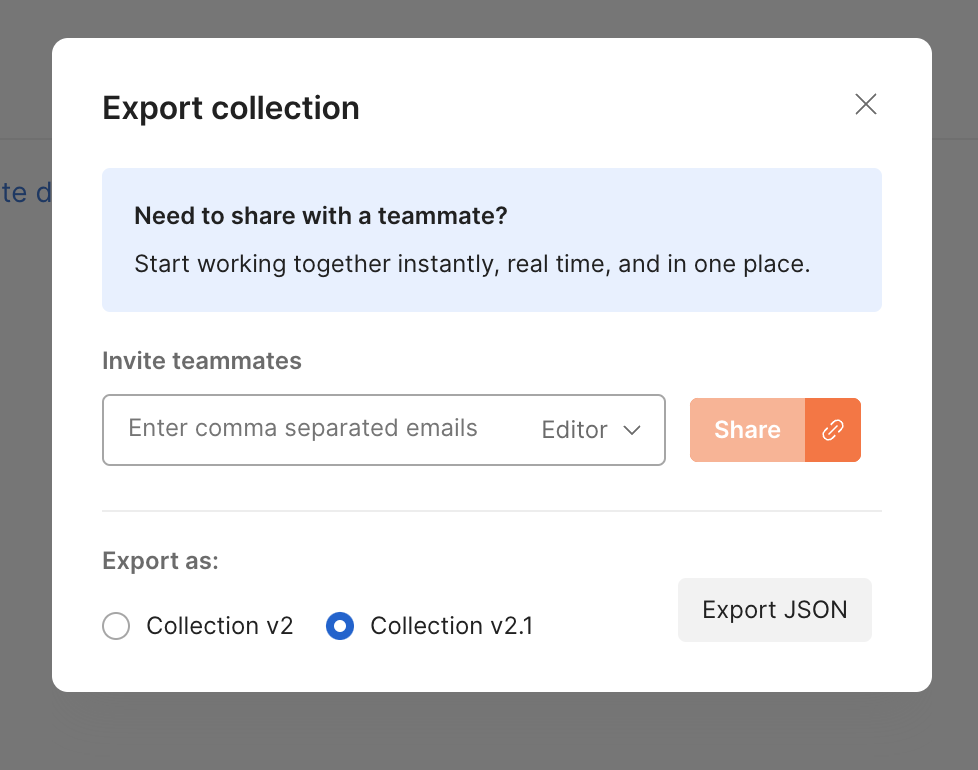

# Mock Server

Postman 컬렉션을 기반으로 동작하는 Node.js Mock 서버입니다.

## 프로젝트 시작 방법

### 1. Postman 컬렉션 Export

Postman에서 컬렉션을 JSON 형태로 export합니다.

1. Postman에서 컬렉션 선택
2. 우측 상단의 "..." 메뉴 클릭
3. "Export" 선택



4. Collection v2.1 형태로 export



### 2. 파일 설정

Export한 파일의 이름을 `postman.json`으로 변경한 후 프로젝트 루트 디렉토리에 추가합니다.

### 3. 서버 실행

```bash
npm install

npm run start
```

### 4. 서버 접속

서버가 성공적으로 실행되면 `localhost:3001` 포트에서 Mock 서버에 접속할 수 있습니다.
